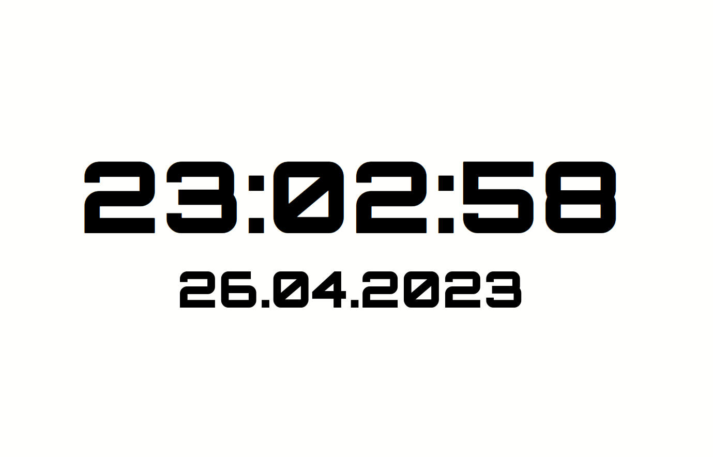

# Digital Clock DOM Widget

## Description

A dynamic digital clock built using HTML, CSS, and JavaScript. The clock not only displays the current time down to the second but also showcases the date. The design of the clock changes between day and night, offering a visually pleasing experience to the user.

The Digital Clock project offers an elegant and dynamic way to keep track of time. Whether you're using it as a desktop accessory or integrating it into another project, this clock combines functionality with aesthetics, making time tracking a delight.

## Features

1. **Real-Time Display:** The clock provides a real-time display, updating every second to ensure accuracy.
2. **Date Presentation:** Alongside the time, the current date is also showcased in a DD.MM.YYYY format.
3. **Dynamic Design:** Depending on the time of day, the clock's design transitions between a daytime and nighttime theme.
4. **Responsive:** The display scales elegantly with different viewport sizes, ensuring clarity and readability.

## JavaScript Techniques

1. **DOM Manipulation:** The code interacts with the DOM to update the clock and date displays.
2. **Interval Timing:** The `setInterval` function is utilized to ensure the clock updates every second, providing real-time accuracy.
3. **Date Object:** JavaScript's `Date` object is employed to retrieve and manipulate the current time and date.
4. **Dynamic Styling:** Based on the current hour, the design of the clock changes, demonstrating how JavaScript can be used to dynamically alter CSS properties.
5. **String Padding:** To ensure consistent formatting, a padding function is used, making sure that single-digit numbers are displayed as two digits.

## The JavaScript functionality for the digital clock project is as follows:

1. **DOM Selection:** The script starts by selecting various elements from the DOM, namely the clock display, the date display, and the body.
2. **Padding Function:** The `padNumber(num)` function pads numbers to ensure that they always have at least two digits (e.g., '09' instead of '9'). This is particularly useful for the clock display.
3. **Clock Update:** The `updateClock()` function performs several tasks:
   - It retrieves the current time using the `Date` object.
   - Based on the current hour, it changes the background color of the body to black (for nighttime) or white (for daytime).
   - It updates the `clock` element with the current time in HH:MM:SS format, using the padding function to ensure each component has two digits.
4. **Interval Timing:** The `setInterval` function is used to call the `updateClock()` function every second, ensuring the displayed time is always up-to-date.
5. **Date Display:** The `displayDate()` function retrieves the current date using the `Date` object and updates the `date` element with the current date in DD.MM.YYYY format, using the padding function for the day and month.
